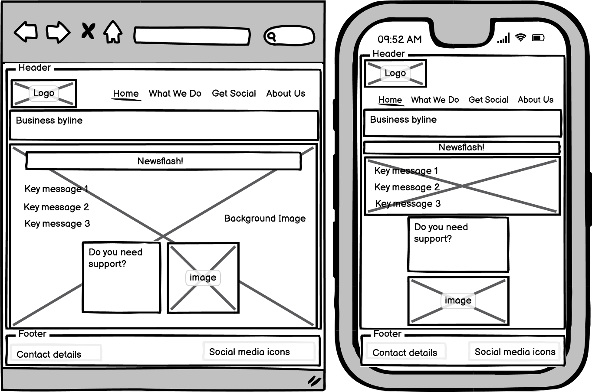
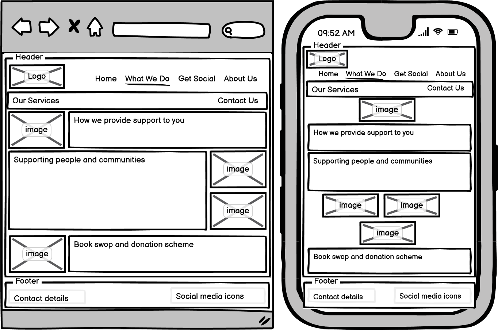
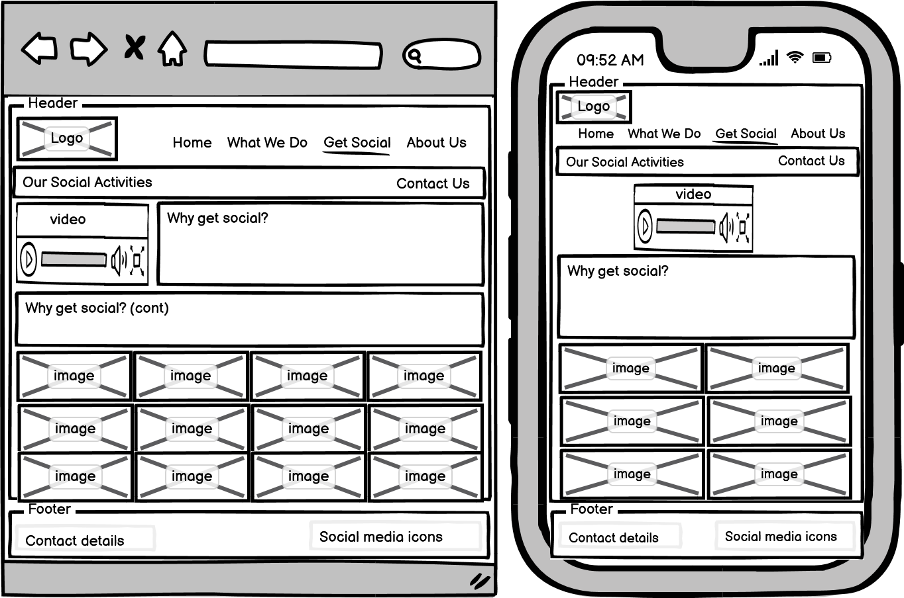
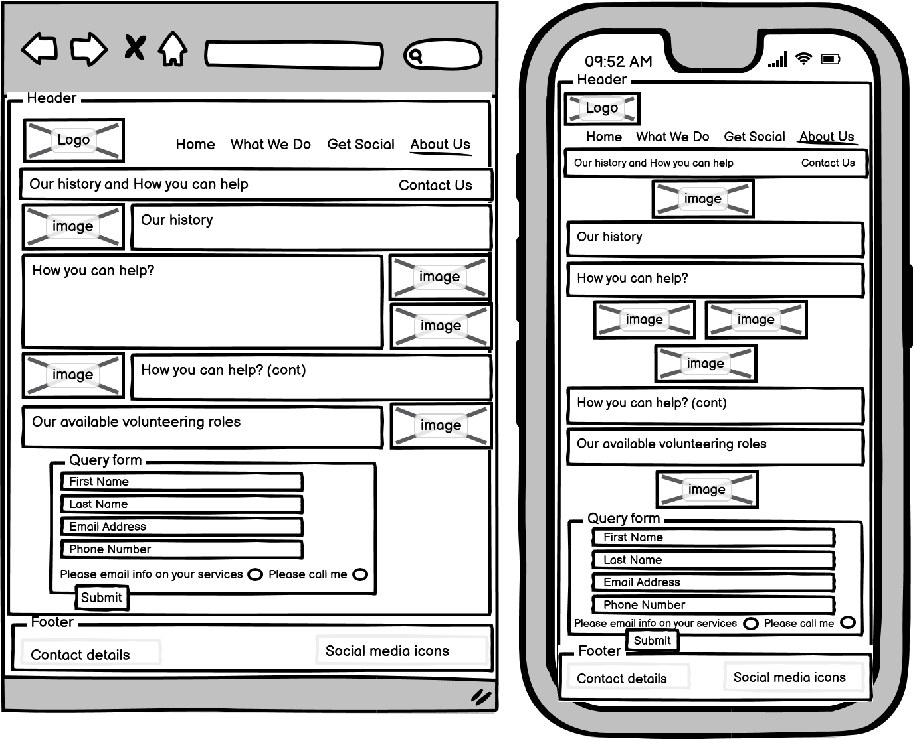

# Fultum Wiltshire Charity

## Purpose
This website was created to both showcase the services and extend awareness of the Fultum Wiltshire Charity. The Charity is locally based and intended to serve the residents in the County of Wiltshire in the UK. The Charity supports people and communities with the following services:
* Companionship and help with essential services
* Community transport via a shuttle service
* Short term support and help coping with emotional traumas such as bereavement
* Provision of life skills workshops intended to support independent living
* Provision of hobby workshops and social gatherings to encourage community participation
* A book swop and donation scheme

The live project can be found [here](https://colettethomson.github.io/Fultum-Wiltshire-Charity/assets/index.html)

## Mockup of the Fultum Wiltshire Charity website

## User Experience Design

### User Stories
#### New User Goals
* As a new user, I want to immediately understand the main purpose of the website
* As a new user, I want information on what services they offer
* As a new user, I want to be able to easily contact the organisation
* As a new user, the navigational layout must be easy to understand and follow
* As a new user, I want to be able to view the website on all device types

#### Regular User Goals
* As a regular user, I want to determine ways to contact and request additional information about new or improved services
* As a regular user, I want to view and follow the organisation's social media
* As a regular user, I want to see the updated social page photos

### Structure of the Fultum Wiltshire Charity website

#### Website Responsiveness
* CSS @media queries have been used to ensure the website is viewable across laptops/desktops, tablets and mobile phones. The size and layout of both text content and images will adapt according to the viewing device to ensure readability and quality.
* All features on each web page are fully accessible and responsive across all viewing devices (laptops/desktops, tablets and mobile phones). 
* This feature fulfills the user story: *'As a new user, I want to be able to view the website on all device types'*. 

#### Navigation Bar
* Present on all four pages of the website, the fully navigational horizontal menu on the top right side of each page gives menu links to the 'Home', 'What We Do', 'Get Social' and 'About Us' pages.
* This feature is intended to enable the user to quickly and easily navigate between web pages without having to utlise the browser 'back' button.
* This feature fulfills the user stories: *'As a new user, the navigational layout must be easy to understand and follow'* and *'As a new user, I want information on what services they offer'*.

#### 'Contact Us' Link
* Present on two pages of the website ('What We Do' and 'Get Social'), this link on the top right side of the web page (underneath the menu), enables quick access to the 'About Us' page which contains an online 'Query Form', where the user can request more information through completion of this form with the options of: return by email, or a return phone call to the user by the charity.
* This feature fulfills the user stories: *As a new user, I want to be able to easily contact the organisation'* and *'As a new user, I want information on what services they offer'* and *'As a regular user, I want to determine ways to contact and request additional information about new or improved services'* and *'As a new user, the navigational layout must be easy to understand and follow'*.

#### Footer Element
* Present on all four pages of the website, the footer details all contact information, the registered charity number and provides external links to the charity's social media presence.
* This feature fulfills the user stories: *'As a regular user, I want to determine ways to contact and request additional information about new or improved services'* and *'As a regular user, I want to view and follow the organisation's social media'*.

#### The 'Home' Page or Landing Page
* This page is intended to provide an at-a-glance view of the main purpose of the website and to provide a contact number for users who would like immediate telephonic information.
* Links are provided within the page to take the user directly to the 'What We Do' and 'Get Social' pages.
* This page displays a 'Newsflash!' animated banner, which informs the user of the latest events happening at the charity.
* This feature fulfills the user stories: *'As a new user, I want to immediately understand the main purpose of the website'* and *'As a new user, I want to be able to easily contact the organisation'* and *'As a new user, the navigational layout must be easy to understand and follow'*.

#### The 'What We Do' Page
* This page details all the services the charity offers.
* This feature fulfills the user story: *'As a new user, I want information on what services they offer'*.

#### The 'Get Social' Page
* This page outlines the different types of social activities the charity offers.
* A video highlights the latest events of the charity. This video would be regularly updated.
* A photo gallery shows images from the various social gatherings and workshops the charity offers as part of their services.  This gallery would be regularly updated.
* This feature fulfills the user stories: *As a regular user, I want to see the updated social page photos'* and *'As a new user, I want information on what services they offer'*.

#### The 'About Us' Page
* This page provides general information about the charity, including its history; how both businesses and individuals can volunteer or donate to the charity; and available job opportunities.
* The online 'Query Form' is located at the bottom of this page and is intended to provide users with a means to request information either by return email or through a return phone call.
* This feature fulfills the user stories: *'As a new user, I want information on what services they offer'* and *'As a new user, I want to be able to easily contact the organisation'* and *'As a regular user, I want to determine ways to contact and request additional information about new or improved services'*.

### Design of the Fultum Wiltshire Charity website

#### Colour Scheme
The colour palette chosen consists of four basic colours:  #ce5108 (orange); #0463bb (blue); #ffca4b (yellow); and #80000 (maroon). The body text colour is mostly #3a3a3a (dark grey) with some sections in #000000 (black), and other sections in #ffffff (white).  The colours were chosen to compliment each other and provide the necessary contrast. The colour palette was developed using **Coolors**.

#### Fonts
The logo is using **Shadows Into Light**; all headings are using **Roboto**; and the body text is using **Poppins**.  The back-up font is **sans-serif**.  Fonts were downloaded from **Google Fonts**.

#### Imagery, Icons, Links, Video
Images for the website have been downloaded from **Pexels**.  The social media icons were downloaded from **Font Awesome**.  Some of the links were created using **Bootstrap**. The MP4 video was downloaded from **All Free Downloads**.

#### Wireframes
**Home Page**  
  
**What We Do Page**  
  
**Get Social Page**  
  
**About Us Page**   
  

### Limitations
As there is no JavaScript functionality present in this website, the Query Form on the 'About Us' page will not receive and store data.
This results in a browser error message when the 'submit' button is pressed.

### Features
* Newsflash animated banner - displays for 2.5 seconds on opening of 'Home' page.
* The Query Form - this can be completed on the 'About Us' page.  It can also be accessed via the 'Contact Us' link displayed at the top right of the 'What We Do', 'Get Social' and 'About Us' pages - and from the navigational menu.
* Masonry Gallery - visible on the 'Get Social' page.  It can also be accessed from a link on the 'Home' page, as well as the navigational menu.
* Embedded video - this video is controlled by the user and is not set to automatically play.

## Technologies
* HTML - the structure of this website project uses HTML as the main language.
* CSS - the styling of this website encompasses custom written CSS.
* [Bootstrap](https://getbootstrap.com/) - utilised for some of the links within this website.
* [Google Fonts](https://fonts.google.com/) - utilised for the logo (Shadows Into Light); the headings (Roboto) and the body text (Poppins).
* [Font Awesome](https://fontawesome.com/) - utilised for the social media icons.
* [Coolors](https://coolors.co/) - utilised for the colour palette design.
* [All Free Downloads](https://all-free-download.com/free-footage/) - utlised for the MP4 video.
* [GitHub](https://github.com/) - hosting site for storage of source code for the website and [Git Pages](https://pages.github.com/) for the deployment of the website.
* [Git](https://git-scm.com/) - used as version control software to commit and push code to a GitHub repository where all source code is located.
* [Google Chrome Developer Tools](https://developer.chrome.com/docs/devtools/) - these are built in developer tools used to inspect page elements (eg. responsive design); debug issues; and test different CSS styling options.
* [balsamiq Wireframes](https://balsamiq.com/wireframes/) - used to create wireframes for the 'Skeleton Plane' of User Experience Design.

## Testing
* This is a static website with no back-end functionality - therefore testing will be performed on visual effect and website layout. 
* Testing will be performed to check for compatibility across three web browsers (Google Chrome; Firefox; and Opera) 
* Responsive design will be tested across the different screen sizes: desktop/laptop (1200px and below); tablet (950px and below); and mobile phone (430px and below).
* All navigational links should direct to the correct html web page as per their names.  The exception here is the 'Home' page, as it will redirect to 'index.html'.
* All links to external websites are to open in a new browser page.
* Testing of the 'Query Form' to ensure correct field input, and that all required fields are completed. 
* Testing of the video link to ensure the user has to click 'play' to run the video and that the video does not play automatically upon opening of the web page.

The live project can be found [here](https://colettethomson.github.io/Fultum-Wiltshire-Charity/assets/index.html)

### Test Cases
Test cases can be found [here](assets/images/fultum-wiltshire_test-cases.jpg)

### Code Validation
All HTML pages were run through the [W3C Markup Validation Service](https://validator.w3.org/) and showed no errors. 
The CSS stylesheet was run through the [CSS Validation Service-Jigsaw](https://jigsaw.w3.org/css-validator/) and showed no errors. 

### Issues found during testing
* Query form submission:  upon clicking the 'submit' button, the inputted data should be 'posted' to an external database.  This is not occurring due to the web site limitation of no JavaScript functionality.
* Testing across Chrome, Firefox and Opera:  In the Opera mobile screen view of the 'Home' page, the 'How can we support you' box slightly overlaps the above main image.  Readability and usability of this page is not affected by this box overlap.

## Deployment
### Project Creation
The project was created using GitHub and choosing a new [repository](https://github.com/ColetteThomson/Fultum-Wiltshire-Charity). 
The following terminal commands were used during this project:
* git add . - this command adds a change in the working directory to the staging area.
* git commit -m "*message*" - this command details the change/s made in the 'message' section and then commits the changes to the local repository.
* git push - this command is used to push all changes to the GitHub repository.

### Using GitHub Pages
* Navigate to the GitHub [repository](https://github.com/ColetteThomson/Fultum-Wiltshire-Charity).
* Select 'Settings'.
* Scroll down to 'GitHub Pages'.
* Select 'Main' branch as the source and click 'Save' button.
* Select link to go to live published page.

## Credits
### Code
The private collaboration and knowledge sharing SaaS platform [Stack Overflow](https://stackoverflow.com/) was an invaluable resource for general coding queries.

### Content
Inspiration for website content was taken from [Royal Voluntary Service](https://www.royalvoluntaryservice.org.uk/).  The idea for a charity website was devised from an actual need in my immediate local community.

### Acknowledgements
Guidelines for this ReadMe file were taken from the Readme file of Daisy McGirr, a former student.

